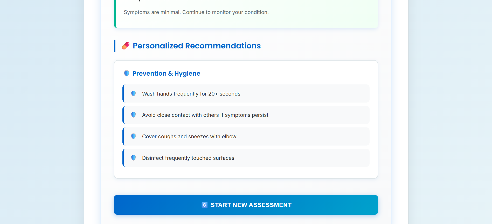

# 🏥 Medical Symptom Checker

[](https://www.python.org/downloads/)
[](https://flask.palletsprojects.com/)
[](LICENSE)


An intelligent symptom diagnosis system that analyzes patient symptoms and provides potential diagnoses with confidence scores and personalized recommendations.

> **⚠️ DISCLAIMER**: This is an educational project for learning purposes only. It is not intended for actual medical diagnosis. Always consult qualified healthcare professionals for medical concerns.

---

## 📸 Screenshots

### Main Interface

*Symptom assessment form with temperature input*

### Severity Assessment

*Interactive sliders to rate symptom intensity (0-10 scale)*

### Diagnosis Results

*Disease detection with confidence scores and matched symptoms*

### Medical Recommendations

*Personalized medical suggestions and home care instructions*

---

## ✨ Features

- **🔍 Multi-Disease Detection**: Analyzes 9 common medical conditions
- **📊 Symptom Tracking**: Monitors 22+ symptoms across multiple categories
- **🎯 Confidence Scoring**: Provides percentage-based confidence for each diagnosis
- **💡 Smart Recommendations**: Emergency alerts, medical guidance, and home care tips
- **🎨 Modern UI**: Responsive design with interactive sliders and color-coded indicators
- **🔒 Privacy-First**: All processing happens locally—no data stored or transmitted
- **📋 JSON Configuration**: Easy-to-maintain disease and recommendation database

## 🚀 Quick Start

### Prerequisites
- Python 3.7 or higher
- pip (Python package installer)

### Installation

1. **Clone the repository:**
   ```bash
   git clone https://github.com/YOUR_USERNAME/medical-symptom-checker.git
   cd medical-symptom-checker
   ```

2. **Install dependencies:**
   ```bash
   pip install -r requirements.txt
   ```

3. **Run the application:**
   ```bash
   python app.py
   ```

4. **Open in browser:**
   ```
   http://localhost:5000
   ```

## 📖 Usage

1. **Enter Temperature**: Input your body temperature in Celsius (35-43°C)
2. **Rate Symptoms**: Use sliders to rate each symptom from 0 (none) to 10 (severe)
3. **Analyze**: Click "Analyze Symptoms" to get results
4. **Review Results**: Check diagnoses, confidence scores, and recommendations

## 🌐 Deployment

### Deploy to Vercel (Recommended)

This app is configured for easy deployment to Vercel:

1. **Push to GitHub:**
   ```bash
   git push origin main
   ```

2. **Deploy to Vercel:**
   - Visit [vercel.com](https://vercel.com)
   - Import your GitHub repository
   - Click "Deploy"
   - Your app will be live at `your-project.vercel.app`

See [DEPLOYMENT.md](DEPLOYMENT.md) for detailed deployment instructions, troubleshooting, and configuration options.

### Other Platforms

This Flask app can also be deployed to:
- **Heroku**: Add a `Procfile` with `web: gunicorn app:app`
- **PythonAnywhere**: Upload files and configure WSGI
- **Railway**: Auto-detects Flask apps
- **Render**: Configure as a web service

## 📁 Project Structure

```
medical-symptom-checker/
├── app.py                    # Main Flask application
├── config.py                 # Configuration settings
├── requirements.txt          # Python dependencies
├── vercel.json               # Vercel deployment config
├── api/                      # Vercel serverless functions
│   └── index.py              # Entry point for Vercel
├── data/                     # JSON data files
│   ├── diseases.json         # Disease database
│   └── recommendations.json  # Medical recommendations
├── utils/                    # Utility modules
│   ├── __init__.py
│   ├── data_loader.py        # JSON data loader
│   ├── diagnosis_engine.py   # Diagnosis logic
│   └── recommendation_engine.py  # Recommendation generator
├── templates/
│   └── index.html            # Web interface
├── static/
│   ├── style.css             # Styling
│   └── script.js             # Client-side logic
└── screenshots/              # Application screenshots
```

## 🧠 How It Works

1. **Data Loading**: Loads disease database and recommendation rules from JSON files
2. **Symptom Collection**: User inputs via interactive sliders and temperature field
3. **Weighted Analysis**: Calculates confidence scores using symptom weights
4. **Temperature Correlation**: Adjusts probabilities based on temperature range matching
5. **Severity Assessment**: Evaluates critical symptoms and overall condition
6. **Recommendations**: Generates personalized advice based on diagnosis and severity

## 🎓 Supported Conditions

- COVID-19 (Coronavirus)
- Seasonal Influenza (Flu)
- Common Cold
- Strep Throat
- Sinusitis
- Bronchitis
- Seasonal Allergies
- Pneumonia
- Migraine

## ⚠️ Important Notes

**This is an educational project with limitations:**

- ✅ Great for learning expert systems and Flask development
- ✅ Demonstrates rule-based AI and medical decision-making
- ⚠️ Limited to 9 common conditions
- ⚠️ Uses rule-based logic, not machine learning
- ⚠️ Does not consider age, gender, or medical history
- ⚠️ Not validated by medical professionals
- ❌ **NOT suitable for actual medical diagnosis**

**Always seek professional medical advice for health concerns.**

## 🤝 Contributing

Contributions are welcome! Please follow these steps:

1. Fork the repository
2. Create a feature branch (`git checkout -b feature/AmazingFeature`)
3. Commit your changes (`git commit -m 'Add some AmazingFeature'`)
4. Push to the branch (`git push origin feature/AmazingFeature`)
5. Open a Pull Request

See [CONTRIBUTING.md](CONTRIBUTING.md) for detailed guidelines.

## 📝 License

This project is licensed under the GNU General Public License v3.0 - see the [LICENSE](LICENSE) file for details.

## 🙏 Acknowledgments

- Norton University - Y3S1 Expert Systems Course
- Flask web framework
- Medical data compiled from reputable healthcare sources

---

**💬 Questions or Issues?** Open an issue on GitHub

**⭐ Found this helpful?** Give it a star!

**📚 Version**: 2.0 (Production Ready) | **Last Updated**: November 2025
